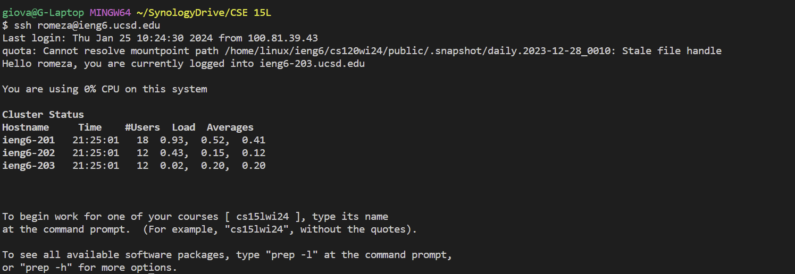

# CSE15L lab report 2
---

## **Part 1**

Code for `ChatServer`:
---
Used AI (ChatGPT) to fix error on why I was kept getting error 404. Also used it to figure out why I was unable to use multiple arguments (Used NumberServer as a base). AI chat prompts found [here](https://chat.openai.com/share/e41d1fa2-b94e-44cb-b8de-bf4c06ac90d9)
```
import java.io.IOException;
import java.net.URI;

class Handler implements URLHandler {
    String msg = " ";

    public String handleRequest(URI url) {
        if (url.getPath().equals("/")) {
            return msg;
        } else if (url.getPath().equals("/add-message")) {
            String query = url.getQuery();
            String[] parameters = query.split("&");
            String[] sParameters = parameters[0].split("=");
            String[] uParameters = parameters[1].split("=");
            if (sParameters[0].equals("s") && uParameters[0].equals("user")){
                msg += uParameters[1] + ": " + sParameters[1] + "\n";
                return String.format("msg added!");
            }
        }
        return "404 Not Found!";
    }
}

class ChatServer {
    public static void main(String[] args) throws IOException {
        if(args.length == 0){
            System.out.println("Missing port number! Try any number between 1024 to 49151");
            return;
        }

        int port = Integer.parseInt(args[0]);

        Server.start(port, new Handler());
    }
}
```
First output: `/add-message?s=Does this work?&user=gio`
---
Output when adding message (url w/ `/add-message?s=Does this work?&user=gio`):
```
msg added!
```
Output when `/add-message?s=Does this work?&user=gio` is removed (defualt url)
```
 gio: Does+this+work?
```
In this output, we see that the methods that were ran include `handleRequest`. As for the argument for the method, `url`, the value that it was given ended up being `https://0-0-0-0-4000-h7dt4qmtt18p1ctk0okplq3m90.us.edusercontent.com/` (url of the server when it was started). As for the other values that were given when the method were ran include a `String` from `uParameter[1]` (user) which had a value of "Gio", and `sParameter[1]` (`String`) had a value of "Does this work?". These 2 values would thne be added to `msg` which was type `String`. The final outcome as it appeared when the code ran would be, `Gio: Does this code run? \n`.

Second Output: `/add-message?s=Yes!&user=pc`
---
Output when adding message (url w/ `/add-message?s=Yes!&user=pc`)
```
msg added!
```
Output when `/add-message?s=Yes!&user=pc` is removed (default url)
```
 gio: Does+this+work?
pc: Yes!
```
For starters, the same methods were still run, with the same `url` parameter value. However, what has changed was the values of `uParameter[1]` which has now become `pc` and `sParameter[1]` which became `Yes!`. With these changes, it also caused a change in `msg` which now has a value of `Gio: Does this work? \n pc: Yes! \n`.

## **Part 2**

Picture of logging in w/out password


Picture w/ `.ssh` in ieng6:


Picture w/ `.ssh` in local device (laptop):


**Part 3**
---
In the past 2 labs, I was now able to deepen my knowledge in creating a server and having it run commands through the url. I was able to deepen it by learning how to make not only 1 argument, but have multiple arguments and demonstrated on this lab report. On top of that, I also learned new commands such as scp and mkdir.


