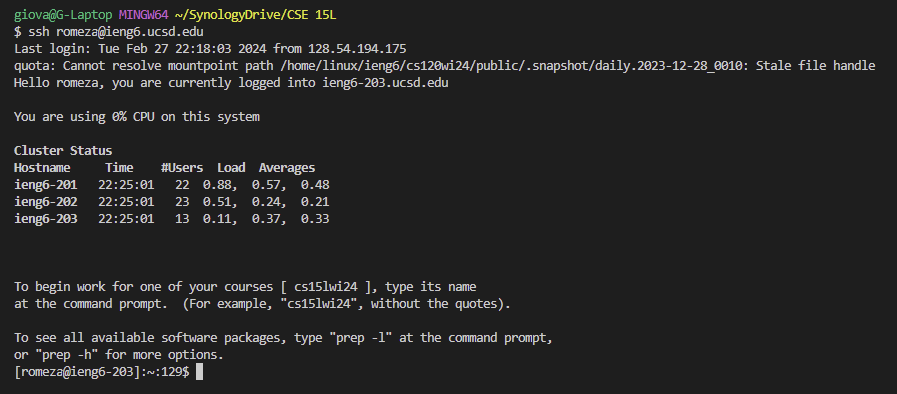
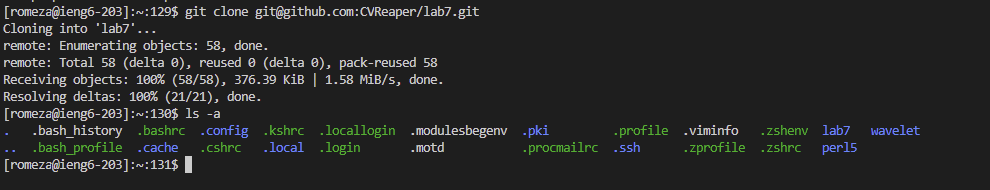
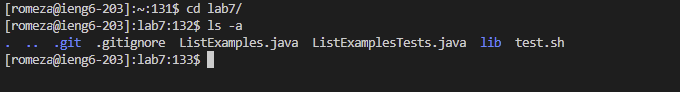
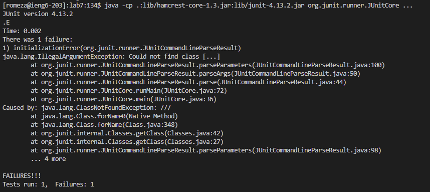
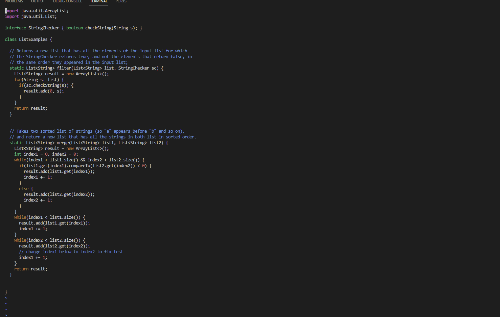
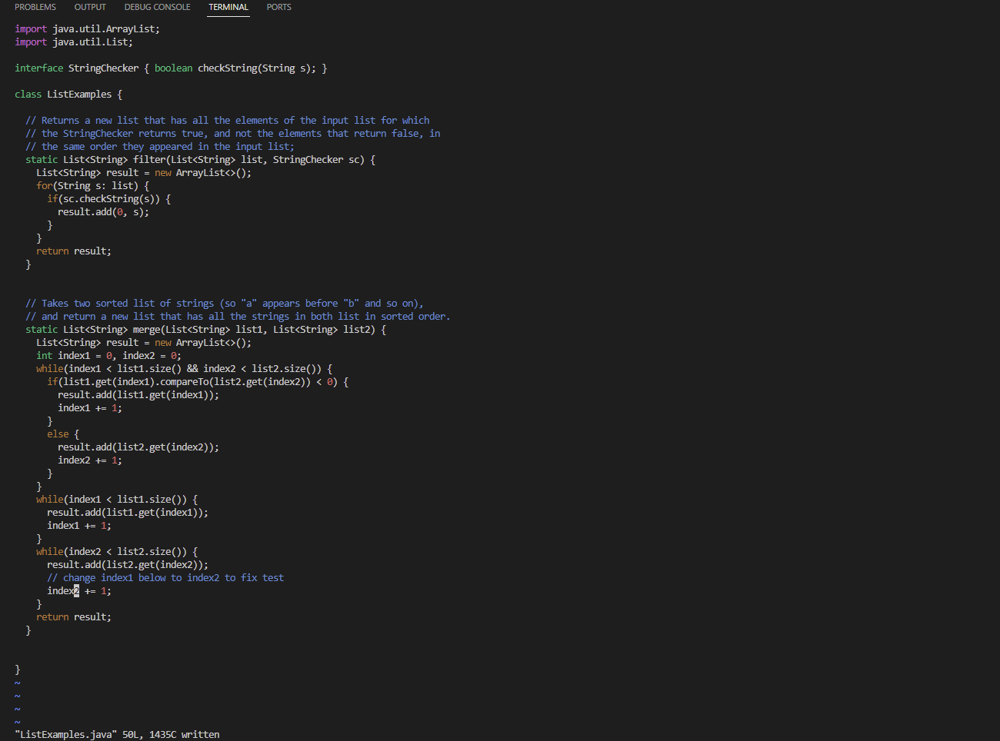
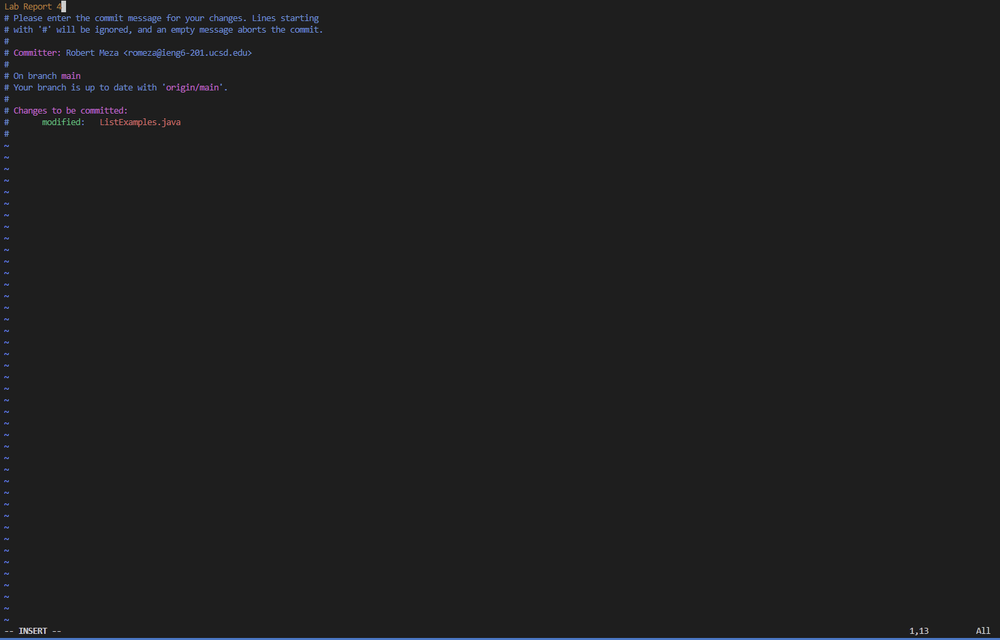
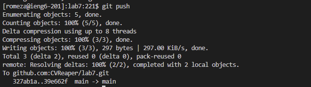

# CSE 15L lab report 4
---

## **Step 1: Log into `ieng6` server.**
First, I connected to my `ieng6` account on the server using the `ssh` command. The command used was `ssh romeza@ieng6.ucsd.edu`.

## **Step 2: Cloning the `lab7` fork onto the server.**
Second, since I had already forked the `lab7` file onto my own repository, I grabbed the `ssh` link of the file and cloned it onto the server using `git clone`. The command used was `git clone git@github.com:CVReaper/lab7.git`.

## **Step 3: `cd` Onto `lab7` (the new directory).**
Though this step is unecessary, it does make things convinent. I ran the command `cd lab7/` so that itll put me onto the `lab7/` directory.

## **Step 4: Running the tests.**
In this step, I ran the tests which can be found in `ListExamplesTest.java`. The command ran was `javac -cp .:lib/hamcrest-core-1.3.jar:lib/junit-4.13.2.jar *.java`. After compiling, I then ran `java -cp .:lib/hamcrest-core-1.3.jar:lib/junit-4.13.2.jar org.junit.runner.JUnitCore ...`. The output was that 1 out of 1 tests failed.

## **Step 5: Open the java file using `vim`.**
In this step, I ran `vim` to open `ListExamples.java`. The command ran was `vim ListExamples.java`.

## **Step 6: Edit the code.**
In this step, while in `vim`, I edit the code so that `index1` was changed to `index2`. The following keys were pressed to make the change. Assume curser is at the very beginning. `<43><j>` (Moves curser 43 lines down). `<right><right><right><right><right><right><right><right><right><right><right>` (puts curser onto "1"). `<x><i><2><esc>` (Deletes a character, goes into insert mode, inserting "2", and goes back into normal mode. `<:w><:qa>` (This saves the file, and exits `vim`).

## **Step 7: Commit and Push**
In this step, we have to publish the new edits on the file. To do this, I ran `git commit ListExamples.java`. Doing this opened up lines of text asking if I were to put a message, in which I put "Lab Report 4". Since its the only file that was edited, it was the only file that needed to be commited. Afterwards, I did `git push`. This command pushes the new edits onto github.

