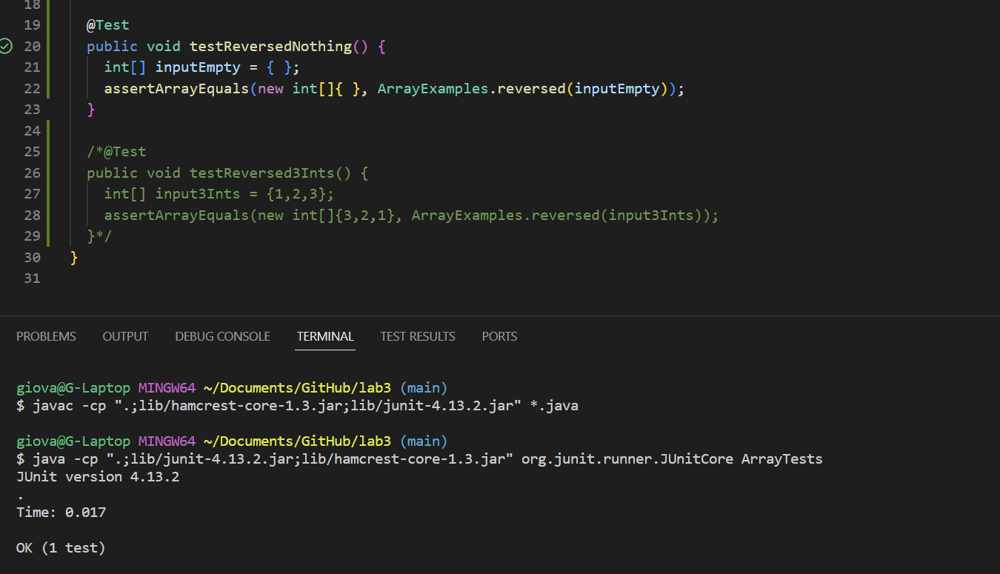

# CSE 15L lab report 3
---

## **Part 1**

The bug I will be testing or working with is the bugs involved in `ArrayExamples.java`. Specifically, the bug found in the `reveresed` method.

A failure inducing input for the buggy program as a JUnit test:
```
@Test
  public void testReversed3Ints() {
    int[] input3Ints = {1,2,3};
    assertArrayEquals(new int[]{3,2,1}, ArrayExamples.reversed(input3Ints));
  }
```
* Running this test tells us if the code can reverse an array with more than 1 values inside it.

A non-failure inducing input for the program as a JUnit test:
```
@Test
  public void testReversedNothing() {
    int[] inputEmpty = { };
    assertArrayEquals(new int[]{ }, ArrayExamples.reversed(inputEmpty));
  }
```
* Running this test tells us if the code can reverse an array containing no values (empty).

Screenshot of output after runnng first Test:

* With this test failing, it demonstrates that the error comes from not being able to reverse the array, demonstrated with the actual given which gave a failure being `0`, when it should be `3`.

Screenshot of output after running 2nd test:

* With this test passing, it tells us that reversing an array without a value is successful.

Method containing bug:
```
  static int[] reversed(int[] arr) {
    int[] newArray = new int[arr.length];
    for(int i = 0; i < arr.length; i += 1) {
      arr[i] = newArray[arr.length - i - 1];
    }
    return arr;
  }
```
Method with bug fixed:
```
  static int[] reversed(int[] arr) {
    int[] newArray = new int[arr.length];
    for(int i = 0; i < arr.length; i += 1) {
      newArray[i] = arr[arr.length - i - 1];
    }
    return newArray;
  }
```
* The bug in this method was that the `newArray` was being copied onto `arr`, but the issue with this was that `newArray` contained no values. In order to fix this, I made it so `arr` was being copied onto `newArray` within the loop. On top that, I also changed the `return` statement from `arr` to `newArray`.

## **Part 2**
What I am researching: `find`
Option/Alternative 1: `find -name`
* Example 1:
```
giova@G-Laptop MINGW64 ~/SynologyDrive/CSE 15L/docsearch/technical (main)
$ find -name 1468-6708-3-1.txt
./biomed/1468-6708-3-1.txt
```
In this example, I use the `-name` option to `find`, which allows me to locate a file that was given as its argument. The output of the command was the paths to find the file I attempted to look for.
* Example 2:
```
giova@G-Laptop MINGW64 ~/SynologyDrive/CSE 15L/docsearch/technical (main)
$ find -name "*chapter*"
./911report/chapter-1.txt
./911report/chapter-10.txt
./911report/chapter-11.txt
./911report/chapter-12.txt
./911report/chapter-13.1.txt
./911report/chapter-13.2.txt
./911report/chapter-13.3.txt
./911report/chapter-13.4.txt
./911report/chapter-13.5.txt
./911report/chapter-2.txt
./911report/chapter-3.txt
./911report/chapter-5.txt
./911report/chapter-6.txt
./911report/chapter-7.txt
./911report/chapter-8.txt
./911report/chapter-9.txt
```
In this example, I use the `-name` option to `find` to help me find all files that contain the name `"chapter"`. The output of this command was the paths to all of the files containing the name.
* Source: Personal notes, ChatGPT (link found at the bottom)

Option/Alternative 2: `find -type`
* Example 1:
```
giova@G-Laptop MINGW64 ~/SynologyDrive/CSE 15L/docsearch/technical (main)
$ find -type d
.
./911report
./biomed
./government
./government/About_LSC
./government/Alcohol_Problems
./government/Env_Prot_Agen
./government/Gen_Account_Office
./government/Media
./government/Post_Rate_Comm
./plos
```
In this example, I use the `-type` option to find all the directories, as demonstrated with the `d` argument. As the output, it gave me all the directories within `/technical`.
* Example 2:
```
giova@G-Laptop MINGW64 ~/SynologyDrive/CSE 15L/docsearch/technical (main)
$ find 911report/ -type f
911report/chapter-1.txt
911report/chapter-10.txt
911report/chapter-11.txt
911report/chapter-12.txt
911report/chapter-13.1.txt
911report/chapter-13.2.txt
911report/chapter-13.3.txt
911report/chapter-13.4.txt
911report/chapter-13.5.txt
911report/chapter-2.txt
911report/chapter-3.txt
911report/chapter-5.txt
911report/chapter-6.txt
911report/chapter-7.txt
911report/chapter-8.txt
911report/chapter-9.txt
911report/preface.txt
```
In this example, I use the `-type` option to find all the files found within `/technical/911report/`. As the output, it gave me all the paths to the files within that directory. (Ideally would search for all the files within `/technical` but searhed within `/technical/911report/` due to a lot of text that would be printed out)
* Sources: ChatGPT (Link found at the bottom)

Option/Alternative 3: `-delete`
* Example 1:
```
giova@G-Laptop MINGW64 ~/SynologyDrive/CSE 15L/docsearch/technical (main)
$ find government/About_LSC/ -name "commission_report.txt" -delete

```
In this example, I use the `-delete` option to delete a file named `commission_report.txt` using `-name`, which was found within `./government/About_LSC`. There was no output, however, looking through the directories and paths of the file, it does demonstrate it did delete said file.

* Example 2:
```
giova@G-Laptop MINGW64 ~/SynologyDrive/CSE 15L/docsearch/technical (main)
$ find government/About_LSC/ -type f -delete

```
In this example, I deleted files, however, instead of deleting a singular file, I deleted all files found within `./government/About_LSC` directory using `-type`. Similarly to the last example, there is no output, however, viewing the paths and directories, it does show that an action was performed.

* Source: ChatGPT (Link found at the bottom)

Option/Alternative 4: `empty`
* Example 1:
```
giova@G-Laptop MINGW64 ~/SynologyDrive/CSE 15L/docsearch/technical (main)
$ find -type d -empty
./government/About_LSC
```
In this example, I use the `-empty` option to find all empty directories by also using `-type`. Since I used the `-delete` option to delete all the files in a directory in the last option, it made `./government/About_LSC` empty, which allowed the `-empty` option to locate it.

* Example 2:
```
giova@G-Laptop MINGW64 ~/SynologyDrive/CSE 15L/docsearch/technical (main)
$ find -type f -empty
./911report/empty.txt
```
In this example, I created a file named `empty.txt` that is found within the `./911report` directory. Doing this allowed me to use the `-empty` option, which would lead me to finding `empty.txt`.

Sources: ChatGPT (Link found Below)

## AI usage
In this labReport, I used chatGPT to help me find options, commands, and how to use them. The link to the prompts used can be found https://chat.openai.com/share/e5c424e0-9418-4ff3-9120-afe7b96f22ff .
