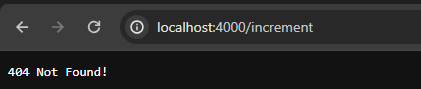

# CSE 15L lab report 5
---

## Part 1: Debugging Scenario

**Context:**
Student Name - Kay

TA - Gio

Directory Structure:
```
PA15/
    └── wavelet/
            ├── NumberServer.java
            ├── Server.java
            └── runServer.sh
Credit to Chat GPT for a copy and paste for this structure
```

Inside `NumberServer.java`: 
```
import java.io.IOException;
import java.net.URI;

class Handler implements URLHandler {
    // The one bit of state on the server: a number that will be manipulated by
    // various requests.
    int num = 0;

    public String handleRequest(URI url) {
        if (url.getPath().equals("/")) {
            return String.format("Number: %d", num);
        } else if (url.getPath() == ("/increment")) {
            num += 1;
            return String.format("Number incremented!");
        } else {
            if (url.getPath().contains("/add")) {
                String[] parameters = url.getQuery().split("=");
                if (parameters[0].equals("count")) {
                    num += Integer.parseInt(parameters[1]);
                    return String.format("Number increased by %s! It's now %d", parameters[1], num);
                }
            }
            return "404 Not Found!";
        }
    }
}

class NumberServer {
    public static void main(String[] args) throws IOException {
        if(args.length == 0){
            System.out.println("Missing port number! Try any number between 1024 to 49151");
            return;
        }

        int port = Integer.parseInt(args[0]);

        Server.start(port, new Handler());
    }
}
```

Inside `Server.java`:
```
// A simple web server using Java's built-in HttpServer

// Examples from https://dzone.com/articles/simple-http-server-in-java were useful references

import java.io.IOException;
import java.io.OutputStream;
import java.net.InetSocketAddress;
import java.net.URI;

import com.sun.net.httpserver.HttpExchange;
import com.sun.net.httpserver.HttpHandler;
import com.sun.net.httpserver.HttpServer;

interface URLHandler {
    String handleRequest(URI url);
}

class ServerHttpHandler implements HttpHandler {
    URLHandler handler;
    ServerHttpHandler(URLHandler handler) {
      this.handler = handler;
    }
    public void handle(final HttpExchange exchange) throws IOException {
        // form return body after being handled by program
        try {
            String ret = handler.handleRequest(exchange.getRequestURI());
            // form the return string and write it on the browser
            exchange.sendResponseHeaders(200, ret.getBytes().length);
            OutputStream os = exchange.getResponseBody();
            os.write(ret.getBytes());
            os.close();
        } catch(Exception e) {
            String response = e.toString();
            exchange.sendResponseHeaders(500, response.getBytes().length);
            OutputStream os = exchange.getResponseBody();
            os.write(response.getBytes());
            os.close();
        }
    }
}

public class Server {
    public static void start(int port, URLHandler handler) throws IOException {
        HttpServer server = HttpServer.create(new InetSocketAddress(port), 0);

        //create request entrypoint
        server.createContext("/", new ServerHttpHandler(handler));

        //start the server
        server.start();
        System.out.println("Server Started!");
    }
}
```

Inside `runServer.sh`:
```
javac *.java

java NumberServer $1
```
## Subject of Post: PA 15: Introduction to URL's and Servers and Bash Files (actually week 2/3 clone)


Kay - Hi, I currently have an issue with my code. Though it compile and runs, with the server starting successfully, the issue I come across is that when I add `/increment` to the end of the URL, I am expecting for the `num` variable to increment by one, and text to appear saying that it incremented. However, when I type `/increment` to the end of the URL, I notice that i just get an error saying "404 Not Found!". If it also helps, I am also running the server using the bash file, with the command `bash runServer.sh 4000`.

Here are some screenshots of the issue:



